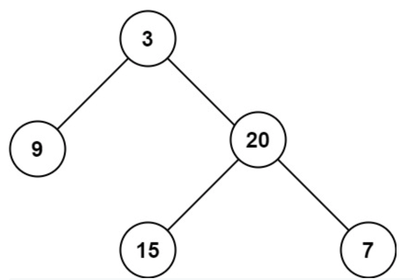

## Problem

Given the root of a binary tree, return its maximum depth.

A binary tree's maximum depth is the number of nodes along the longest path from the root node down to the farthest leaf node.

<hr>

#### Example 1

<!--  -->

```
Input: root = [3,9,20,null,null,15,7]
Output: 3
```

#### Example 2

```
Input: root = [1,null,2]
Output: 2
```

#### Example 3

```
Input: root = []
Output: 0
```

<hr>

### Explanation

We essentially need to find the longest path from the root node and add 1 to it.

<hr>

## Solution

#### Approach: Recuring the Tree with Depth First Search

The approach mentioned above with two pointers can be implemented as follows:

```Python
class Solution(object):
    def maxDepth(self, root):
        """
        :type root: TreeNode
        :rtype: int
        """
        if root == None: # If the node is None, return 0
            return 0
        else:
            leftMax = self.maxDepth(root.left) # Get maxdepth from left subtree
            rightMax = self.maxDepth(root.right) # Get maxdepth from right subtree

            return 1 + max(leftMax, rightMax) # Add 1 and take max
```
